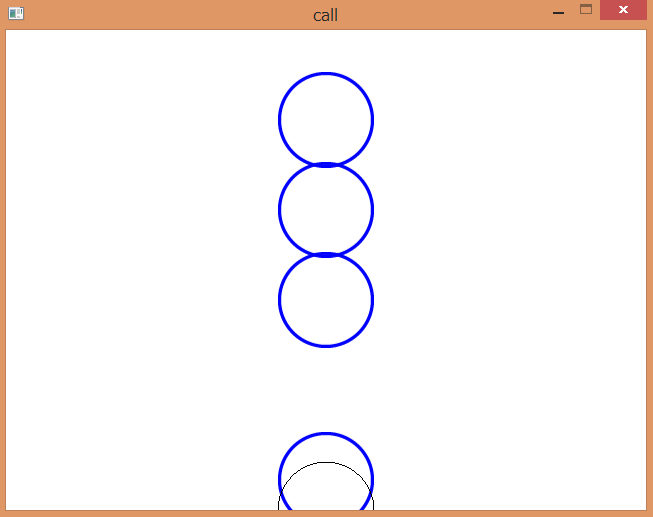

Haskellで作るリズムゲーム
====
Fumiaki Kinoshita (IIJ-IIでバイト) fumiexcel@gmail.com

イントロ
----
リズムゲームは日本で人気なゲームジャンルの1つです。__1998年にDance Dance Revolution (DDR)__ がコナミから発表されてジャンルの中で最も成功している。他に__太鼓の達人__も幅広い年代の人に愛されています。今日も次々と色んな種類のリズムゲームが発表されています。

しかし、この類のゲームのチュートリアルは少ない。あったとしても古すぎたりWindowsでしか動作しなかったりします。

このチュートリアルは苦痛無くリズムゲームを作れるようにと書きました。驚く無かれ、Haskellを使えばできます。

このチュートリアルは3つのパートに分かれています：
* パートIはパートIIとIIIで必要となってくる環境構築について。
* パートIIではシンプルなリズムゲームを作ります。Callエンジンを利用します。
* パートIIIはパートIIを支える技術的な背景（グラフィック、オーディオ等）を紹介します。

このチュートリアルによりゲームを作りたいという意欲が出たら嬉しいです。

パート I： 準備
----
まずはGHCをインストールしなければなりません。[Haskell Platform](https://www.haskell.org/platform/) でインストールするのが楽です。

UnixかMacでは `libportaudio19` をインストールしてください。

__注意：現時点で Call はMac OS Xにてビットマップをちゃんと描画してくれません。原因を分かる人が居れば教えて下さい。__

```
$ sudo <your-package-manager> install libportaudio19
```

このチュートリアルで使われるソースコードは `rhythm-game-tutorial` パッケージにあります。以下のコマンドでダウンロードとセットアップが出来ます：

```
$ cabal unpack rhythm-game-tutorial
$ cd rhythm-game-tutorial-<version>
$ cabal install --only-dependencies
% cabal configure
$ cabal build
```

`cabal install --only-dependencies` で様々なパッケージがインストールされます。中でも `objective` と `call` は重要なパッケージです。

* `objective` はステートフルなオブジェクトの抽象化をしてくれます。必要ではないがステートを扱うときの苦痛を和らいでくれます。
* `call` はクロスプラットフォームなマルチメディアライブラリです。軽量でシンプルでありながら、ゲームで使う様々な媒体（2D/3Dグラフィックス、オーディオ、キーボード・マウス・ゲームパッドからの入力等）に対応しています。
* `binding-portaudio` は低水準なオーディオのAPIです。

### Windowsにて

`bindings-portaudio` はインストールを楽にするためのソースを含んでいます。残念ながらGHCのバグにより時折不安定です。Windows x64の場合32ビット版を使ったほうが安定しているのでこういった問題は回避できます。

```shell
$ cabal install bindings-portaudio -fBundle -fWASAPI
```

よくわからないエラーを投げてきた場合は私に報告してください。

パート II: ゲームを作る
-------------------------------------------------

> さあ始まるドン！ -- 和田ドン、 "太鼓の達人"

シンプルなゲームを思い浮かべてください：画面下に丸があって、他の丸が上から迫ってきます。ちょうど重なったタイミングでスペースキーを押すゲームです。



どのようにして実装すればいいでしょうか？プログラムの構造は以下の要素から成り立ちます：

* __音楽__: ゲーム中に音楽が流れています。
* __グラフィックス__: 時間によってグラフィックスが変わります。
* __インタラクション__: プレイヤーがスペースキーを押した時にスコアが更新されます。

順に説明していきます。

### 音楽を再生する

グルーヴは大事です。音楽を再生しましょう。最初のゲームです(`src/music-only.hs`)：

```haskell
main = runSystemDefault $ do
  music <- prepareMusic "assets/Monoidal Purity.wav"
  playMusic music
  stand
```

実行しましょう：

```shell
$ dist/build/music-only/music-only
```

音楽が聴こえますか？音楽をロードするのに少々時間かかります。

コードを見てみましょう。以下の関数が Call エンジンによる定義されています。

```haskell
runSystemDefault :: (forall s. System s a) -> IO a
stand :: System s ()
```

Call では`System s` モナドにアクションが実行されます。`runSystemDefault` が `System s` を `IO` へと変換します。`stand` は何もしませんがプログラムの終了を止めます。

`prepareMusic` と `playMusic` のシグネチャは以下の通りです：

```haskell
type Music s = Inst (System s) (StateT Deck (System s)) (System s)

prepareMusic :: FilePath -> System s Music
playMusic :: Music -> System s ()
```

これらの関数は後ほど定義します。

### 画像の描画

ゲームのグラフィカルな部分を作っていきましょう。

```haskell
main = runSystemDefault $ do
  allTimings <- liftIO $ (!!0) <$> parseTimings (60/140*4) <$> readFile "assets/Monoidal-Purity.txt"
  linkPicture $ \_ -> renderLane allTimings <$> getTime
  stand
```

`linkPicture :: (Time -> System s Picture) -> System ()` がCallで定義されている唯一の何かを描画するための関数です。`linkPicture f` が繰り返し `f` を呼びその結果をウィンドウに描画します。`f` の引数はフレーム間の時間ですが普通は考えなくてよいです。

ゲームシステムの仕様のため、タイミング等を設定しないといけません。ここでただの数字の羅列よりも読みやすいタイミングの表記法を紹介します。

この表記法はいくつかのパケットによって成り立っていて、複数の小節を表しています。一つのパケットごとに複数の列を含んでいます。小節は列の長さにより分割されます。'.' は音符、'-' は休符です。

    ----.-----------
    .-----------.---
    --------.-------

パーサーの実装は単純です。

```haskell
parseTimings :: String -> [Set Time]
```

タイミングと丸の"寿命"があれば現在の時刻から丸の位置を計算できます。

```haskell
phases :: Set Time -- ^ timings
    -> Time -- ^ life span
    -> Time -- ^ the current time
    -> [Float] -- ^ phase
phases s len t = map ((/len) . subtract t) -- transform to an interval [0, 1]
  $ Set.toList
  $ fst $ Set.split (t + len) s -- before the limit
```

丸を描画する関数を作る。`Picture` はモノイドなので `foldMap` か `mconcat` を使って画像を組み合わせることができます。`translate (V2 x y)` を使って画像を (x, y) の座標へシフトさせます。`bitmap b` を使って `Bitmap` を `Picture` に変換します。

`unsafePerformIO` の型は `IO a -> a` であって見た感じとても見慣れない感じでしょう。`unsafePerformIO` の使用は `getArgs` や `readBitmap` のような__コンスタント__な操作にのみ限定されるべきです。

```haskell
circle_png :: Bitmap
circle_png = unsafePerformIO $ readBitmap "assets/circle.png"

circles :: [Float] -> Picture
circles = foldMap (\p -> V2 320 ((1 - p) * 480) `translate` bitmap circle_png)
```

`renderLane` は `phases` の結果を `circles` に渡します。 `color` で画像の色を指定します。

```haskell
renderLane :: Set Time -> Time -> Picture
renderLane ts t = mconcat [color blue $ circles (phases ts 1 t)
    , V2 320 480 `translate` color black (bitmap circle_png) -- criterion
    ]
```

現時点での `main` はこんな感じです。

```haskell
main = runSystemDefault $ do
  music <- prepareMusic "assets/Monoidal-Purity.wav"
  allTimings <- fmap (!!0) $ liftIO $ loadTimings "assets/Monoidal-Purity.txt"
  linkPicture $ \_ -> renderLane allTimings <$> getTime
  playMusic music
  stand
```

このプログラムにはまだ重要な問題点があります。なんらかの問題でプログラムがつまずくと画像と音楽が__ズレる__可能性があります。実際の時間ではなく音楽の時間を元にタイミングをとらないといけません。

### コンポーネント: prepareMusic

リズムゲームにおいて音楽は欠かせません。

```haskell
type Music s = InstOf (System s) (Variable Deck)

prepareMusic :: FilePath -> System s Music
prepareMusic path = do
  wav <- readWAVE path
  i <- new $ variable $ source .~ sampleSource wav $ Deck.empty
  linkAudio $ playbackOf i
  return i
```

`readWAVE` は `.wav` ファイルから音楽をロードします。 `source .~ sampleSource wav $ Deck.empty` の部分が少々トリッキーです。

Deck は音楽を再生するためのユーティリティです。 `source` は `Lens` で純粋で関数型なアクセサの表現です。 `new $ variable $ v` が音楽を初期化します。 `linkAudio $ playbackOf i` は今はおまじないとでも思っててください。

### コンポーネント: getPosition と playMusic

`getPosition` と `playMusic` の実装は以下の通りです：

```haskell
getPosition :: Music s -> System s Time
getPosition m = m .- use pos

playMusic :: Music s -> System s ()
playMusic m = m .- playing .= True
```

ここで新しく2つの演算子が登場します： `use` と `.=` です。これらは `lens` ライブラリからです。このパッケージは様々のアクセサを扱うための型やユーティリティを含んでいます。

`pos` と `playing` は `Lens` です。 `Lens' s a` では `a` の値の取得の操作を `s` から出来ます。

```haskell
pos :: Lens' Deck Time
playing :: Lens' Deck Bool
```

`use` と `(.=)` はステートフルモナドに対して使える値を取得・設定するための演算子です。

```haskell
use :: MonadState s m => Lens' s a -> m a
(.=) :: MonadState s m => Lens' s a -> a -> m ()
```

lens を利用すればオブジェクトの一部へのアクセスを容易にできて、オブジェクト指向言語でいうメンバー変数のようなものを操作が出来ます。ですが deck のステートは `gameMain` の `music` にパックされているので直接は操作できません。 `objective` パッケージの `(.-)` 演算子は特定の操作を実行できます。

`getPosition m` は音楽 `m` からの経過時間を秒数で正確に返します。

ここまでのソースをまとめたのがこれです `src/tutorial-passive.hs` 。

```shell
$ dist/build/tutorial-passive/tutorial-passive
```

ですがまだゲームではありません。スコアもインタラクションもないです。

### Handling inputs

Let's deal with inputs. Now introduce two components, `rate` and `handle`.

```haskell
rate :: Time -> Int
rate dt
  | dt < 0.05 = 4
  | dt < 0.1 = 2
  | otherwise = 1

handle :: Time -> Set Time -> (Int, Set Time)
handle t ts = case viewNearest t ts of
  Nothing -> (0, ts) -- The song is over
  Just (t', ts') -> (rate $ abs (t - t'), ts')
```

`rate` calculates a score from a time lag. `handle` returns a score and updated timings. `viewNearest :: (Num a, Ord a) => a -> Set a -> (a, Set a)` is a function to pick up the nearest value from a set. If we fail to attend to remove a nearest one, flamming the button causes undesired score increment.

```haskell
data Chatter a = Up a | Down a
```

And the following code actually handles events:

```haskell
linkKeyboard $ \ev -> case ev of
  Down KeySpace -> do
    t <- getPosition
    ts <- timings .- get
    (sc, ts') <- handle t ts
    timings .- put ts'
    score .- modify (+sc)
  _ -> return () -- Discard the other events
```

Note that a few variables has instantiated.

```haskell
timings <- new $ variable (allTimings !! 0)
score <- new $ variable 0
```

After `linkKeyboard` is called, the engine passes keyboard events `Key`. `Key` is wrapped by `Chatter` to indicate that a key is pressed, or released. When the space key is pressed, it computes the time difference from the nearest timing and increment the score by accuracy.

We need to load a _Font_ as we want to show players the current score. `Call.Util.Text.simple` generates a function that renders a supplied text.

```haskell
text <- Text.simple defaultFont 24 -- text :: String -> Picture
```

Just add `text (show sc)` to `renderGame`. `src/tutorial-active.hs` is the updated source we made interactive. It's a game, yay!

```shell
$ dist/build/tutorial-passive/tutorial-active
```


### Extending the game

However, when you actually play this, you may feel dissatisfied. It is because the interaction is still poor. If it would have more showy effects, it'll be exciting. Most rhythm games shows the recent evaluation of accuracy immediately. So, players can notice whether their playing is good or bad.

Thanks to purely functional design, we can extend lanes so easily(`tutorial-extended.hs`)!


`ix i` is a lens that points an `i`-th element of a list. Just arrange the result of `forM` using `translate`.

Another interesting feature, `transit`, is convenient to create animations.

```haskell
pop :: Bitmap -> Object (Request Time Picture) Maybe
pop bmp = Control.Object.transit 0.5 $ \t -> translate (V2 320 360)
  $ translate (V2 0 (-80) ^* t)
  $ color (V4 1 1 1 (realToFrac $ 1 - t))
  $ bitmap bmp
```

The argument `t` varies from 0 to 1, for 0.5 seconds. To instantiate, put this object into a list:

```haskell
effects <- new $ variable []
effects .- modify (pop _perfect_png:)
```

And `effects .- announceMaybe (request dt)` returns `[Picture]`, removing expired animations automatically. It benefits from `objective` much. Here is the complete `linkPicture` section.

```haskell
linkPicture $ \_ -> do
  [l0, l1, l2] <- forM [0..2] $ \i -> renderLane <$> (timings .- use (ix i)) <*> getPosition music
  s <- score .- get
  ps <- effects .- announceMaybe (request dt)
  return $ translate (V2 (-120) 0) l0
    <> translate (V2 0 0) l1
    <> translate (V2 120 0) l2
    <> color black (translate (V2 240 40) (text (show s)))
    <> mconcat ps
```

There is no difficulty around input.

```haskell
let touchLane i = do
      ((sc, obj), ts') <- handle <$> getPosition music <*> (timings .- use (ix i))
      effects .- modify (obj:)
      timings .- ix i .= ts'
      score .- modify (+sc)

linkKeyboard $ \ev -> case ev of
  Down KeySpace -> touchLane 1
  Down KeyF -> touchLane 0
  Down KeyJ -> touchLane 2
  _ -> return () -- Discard the other events
```

Moreover, with `LambdaCase` GHC extension, you can replace `\ev -> case ev of` with `\case`.

The overall game goes in only 120 lines!

```shell
$ wc -l src\tutorial-extended.hs
120
$ dist/build/tutorial-passive/tutorial-extended
```

Part III: Technical background
-----------------

### Graphics

Monoid is the general term for composable stuff which has "empty". A picture is one of the monoids since there is an __empty picture__ and pictures __can be composed__ by overlaying. The standard library `base` provides a typeclass for monoids:

```haskell
class Monoid a where
  mempty :: a
  mappend :: a -> a -> a
```

Call uses __free monoid__ to represent picture.

In de-CPSed form,

```haskell
data Scene = Empty
  | Combine Scene Scene
  | Primitive Bitmap PrimitiveMode (Vector Vertex) -- draw a primitive
  | VFX (VFX Scene) -- apply visual effects
  | Transform (M44 Float) Scene -- transform `Scene` using a matrix
```

Its Monoid instance is trivial.

```haskell
instance Monoid Scene where
  mempty = Empty
  mappend = Combine
```

Using free monoid, we can isolate the drawing process from `Scene`. Think of `drawScene :: Scene -> IO ()` which calls concrete APIs to draw Scene. For empty picture, we don't do nothing. `Combine a b` is equivalent to calling `drawScene a >> drawScene b`.

So the implementation of `drawScene` will be as follows:

```haskell
drawScene Empty = return ()
drawScene (Combine a b) = drawScene a >> drawScene b
drawScene (Primitive b m vs) = drawPrimitive b m vs
drawScene (VFX v) = drawScene (applyVFX v)
drawScene (Transform mat s) = withMatrix mat (drawScene s)
```

where `drawPrimitive`, `applyVFX`, `withMatrix` are environment-dependent.

In other words, free structures are kinds of DSL which encourages the reusability of programs. Andres Löh's [Monads for free!](https://skillsmatter.com/skillscasts/4430-monads-for-free) is a great introduction for free structures.

Call puts together a few kinds of transformation in `Affine` class. Thanks to type families, we can use the same operation for both 2D and 3D. `Normal` is the normal vector, which is 3-dimensional vector in 3D but it is just `Float` in 2D.

```haskell
class Affine a where
  type Vec a :: *
  type Normal a :: *
  rotateOn :: Normal a -> a -> a
  scale :: Vec a -> a -> a
  translate :: Vec a -> a -> a
```

### Audio

Currently, there are few packages for audio that work in common platforms and are easy to install. I choosed `portaudio` for now which supports a bunch of backends. Humans are so sensitive about sound; 20 miliseconds of latency is noticable for us.

Thus, it is important to minimize latency when it comes to audio. This is the main reason of why call relies on callback. The call library aims to be small and concrete, leaving abstraction to `objective`.

Acknowledgements
-------------------------
Special thanks to Kazuhiko Yamamoto for guidance of the architecture of this tutorial.
