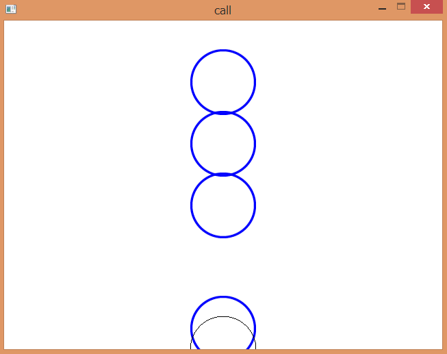
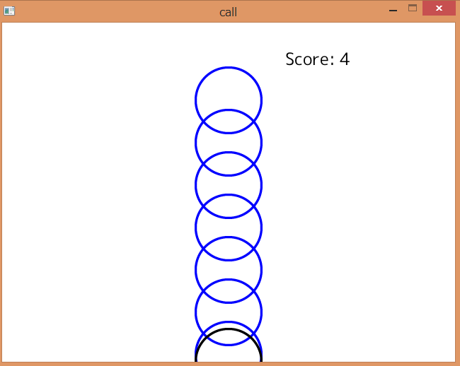
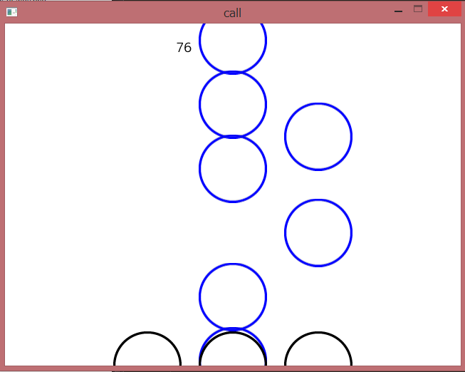

Creating rhythm game with Haskell
====
Fumiaki Kinoshita (part-time employee of IIJ-II)

Introduction
----
Rhythm games, also known as rhythm actions, are very popular genre in Japan. Konami released __Dance Dance Revolution (DDR) in 1998__ -- it is the best successful game among the genre. Another famous one, _Taiko no Tatsujin_(literally, __Expert of Japanese drum__) is being immensely supported by broad age-group of people. Today, various forms of rhythm games have been released one after another.

However, there are few tutorials to create such kind of games. Even if there are, they might be too old, or written in non-English, or/and work only in Windows.

This tutorial focuses on creating a rhythm game without pain. Don't be surprised, we use Haskell to do that.

This tutorial has two parts.

* Part I contains an instruction to set up environment required for Part II and III.
* In Part II, we build a very simple rhythm game. We use the Call engine to develop.
* Part III introduces some technical backgrounds (graphics, audio) that support Part I.

I'd be happy if this tutorial helps your curiosity to create a game.

Part I: Preparation
----

We need to ensure that you have installed GHC. [Haskell Platform](https://www.haskell.org/platform/) is an easy way to install GHC.

On Unix or Mac, install `libportaudio19`.

```
$ sudo <your-package-manager> install libportaudio19
```

The source code used in this tutorial is packed in `rhythm-game-tutorial` package. You can download it and set it up by:

```
$ cabal unpack rhythm-game-tutorial
$ cd rhythm-game-tutorial-<version>
$ cabal install --only-dependencies
% cabal configure
$ cabal build
```

`cabal install --only-dependencies` installs a bunch of packages, including two vital packages: `objective` and `call`.

* `objective` gives an abstraction for stateful objects. It is not neccessary strictly, though it kills the pain of state significantly.
* `call` is a cross-platform multimedia library. While it is small and simple, the essentials of games (2D/3D graphics, audio, input handing from keyboard, mouse and gamepad) is assurable.
* `binding-portaudio` is low-level audio APIs.

### On windows

Unfortunately, installing `bindings-portaudio` is magical on Windows. So, `bindings-portaudio` provides built-in source for installation easiness. Note that using 32-bit version of GHC is safer to avoid problems if your platform is Windows x64.

> $ cabal install bindings-portaudio -fBundle -fWASAPI

If it throws up something messy, please report to me.

Part II: Creating a game
-------------------------------------------------

> Here we bang! -- Wada-don, "Taiko no Tatsujin"

Now, think of a very simple game: There's a circle at the bottom of the window, and another circle(s) is approaching. You hit the space key in exact timing when the another circle overlapped the original one. 



How do we implement this? The structure of the program can be derived by writing components down:

* Sound: a music is playing through the game.
* Visual: pictures depend on the time.
* User interaction: a user types the space key.

We will explain these in order.

### Playing a music

Groove is important. It's time to play a music. `prepareMusic` and `playMusic` will be defined later.

```haskell
main = runSystemDefault $ do
  music <- prepareMusic "assets/Monoidal-Purity.wav"
  playMusic music
  stand
```

Note that it takes a moment to load a music.

The following functions are provided by Call engine.

```haskell
runSystemDefault :: (forall s. System s a) -> IO a
stand :: System s ()
```

In Call, actions are performed on `System s` monad. `runSystemDefault` converts `System s` into `IO`. `stand` does nothing, preventing termination of the program.

```haskell
type Music = InstOf (System s) (Variable Deck)
prepareMusic :: FilePath -> System s Music
playMusic :: Music -> System s ()
```

### Drawing a picture

Let's construct a graphical part of the game.

```haskell
main = runSystemDefault $ do
  allTimings <- liftIO $ (!!0) <$> parseTimings (60/140*4) <$> readFile "assets/Monoidal-Purity.txt"
  linkPicture $ \_ -> renderLane allTimings <$> getTime
  stand
```

`linkPicture :: (Time -> System s Picture) -> System ()` is the only function provided by Call to actually draw something.`linkPicture f` repeatedly calls `f` and draws the result of `f` to the window. The argument of `f` is the time difference between frames, it is often negilible though.

Due to its game system, we need to prepare the set of times. Let us introduce a new notation to represent timings which is more readable than just the list of decimals.

This notation is consist of a number of packets, representing a sequence. Each packets contain several lines. A [小節] is divided by the length of line. '.' and '-' represents a note and a rest.

    ----.-----------
    .-----------.---
    --------.-------

The implementation of the parser is not so interesting.

```haskell
parseTimings :: String -> [Set Time]
```

Given timings and "life span" of circles, we can compute positions of visible circles from the time.

```haskell
phases :: Set Time -- ^ timings
    -> Time -- ^ life span
    -> Time -- ^ the current time
    -> [Float] -- ^ phase
phases s len t = map ((/len) . subtract t) -- transform to an interval [0, 1]
  $ Set.toList
  $ fst $ Set.split (t + len) s -- before the limit
```

Create a function to render circles. Since `Picture` is a monoid, we can use `foldMap` or `mconcat` to combine pictures. `translate (V2 x y)` shifts the picture into (x, y). `bitmap b` turns a `Bitmap` into a `Picture`.

```haskell
circle_png :: Bitmap
circle_png = unsafePerformIO $ readBitmap "assets/circle.png"

circles :: [Float] -> Picture
circles = foldMap (\p -> V2 320 ((1 - p) * 480) `translate` bitmap circle_png)
```

`renderLane` passes the result of `phases` into `circles`. `color` changes a color of a picture.

```haskell
renderLane :: Set Time -> Time -> Picture
renderLane ts t = mconcat [color blue $ circles (phases ts 1 t)
    , V2 320 480 `translate` color black (bitmap circle_png) -- criterion
    ]
```

Here is an updated `main`.

```haskell
main = runSystemDefault $ do
  music <- prepareMusic "assets/Monoidal-Purity.wav"
  allTimings <- fmap (!!0) $ liftIO $ loadTimings "assets/Monoidal-Purity.txt"
  linkPicture $ \_ -> renderLane allTimings <$> getTime
  playMusic music
  stand
```

There is a serious problem in this program. The graphics and music may __diverge__ when the program has stumbled accidentally. We need to use the musical time instead of the real one.

### Component: prepareMusic

A music is essential for rhythm games.

```haskell

type Music s = InstOf (System s) (Variable Deck)

prepareMusic :: FilePath -> System s Music
prepareMusic path = do
  wav <- readWAVE path
  i <- new $ variable $ source .~ sampleSource wav $ Deck.empty
  linkAudio $ playbackOf i
  return i
```

`readWAVE` loads a sound from `.wav` file.`source .~ sampleSource wav $ Deck.empty` is a bit tricky.

Deck is an utility to play a music. `source` is a `Lens` which is purely functional representation of accessors. This tutorial explains about `Lens` later, in Part III. `new $ variable $ v` instantiates a music. Regard `linkAudio $ playbackOf i` as a cliché for now.

### Component: getPosition and playMusic

The implementation of `getPosition` and `playMusic` is as follows:

```haskell
getPosition :: Music s -> System s Time
getPosition m = m .- use pos

playMusic :: Music s -> System s ()
playMusic m = m .- playing .= True
```

You notice two new operators: `use` and `.=`. These comes from the `lens` library. This package contains types and utilities to deal with various accessors.

`pos`, `playing` are `Lens`. Given `Lens' s a`, you can take and modify a value `a` from `s`.

```haskell
pos :: Lens' Deck Time
playing :: Lens' Deck Bool
```

`use` and `(.=)` are getting/setting operators that work on stateful monads.

```haskell
use :: MonadState s m => Lens' s a -> m a
(.=) :: MonadState s m => Lens' s a -> a -> m ()
```

With lens, we can access a specific element of a structure easily, allowing you manipulate just like "fields" in OOP languages. However, the state of the deck is packed in `music` in `gameMain` so these can't be used directly. The `(.-)` operator, provided by `objective` package, executes an action within a context held by a left operand.

`getPosition m` returns an accurate time (in seconds) elapsed from an origin of a music `m`.

Putting them together, we got `src/tutorial-passive.hs`.

It is not a game though -- simply because it has no score, no interaction.

### Handling inputs

Let's deal with inputs. Now introduce two components, `rate` and `handle`.

```haskell
rate :: Time -> Int
rate dt
  | dt < 0.05 = 4
  | dt < 0.1 = 2
  | otherwise = 1

handle :: Time -> Set Time -> (Int, Set Time)
handle t ts = case viewNearest t ts of
  Nothing -> (0, ts) -- The song is over
  Just (t', ts') -> (rate $ abs (t - t'), ts')
```

`viewNearest :: (Num a, Ord a) => a -> Set a -> (a, Set a)` is a function to pick up the nearest value from a set.

```haskell
data Chatter a = Up a | Down a
```

All the input-related things is concentrated in the following:

```haskell
linkKeyboard $ \ev -> case ev of
  Down KeySpace -> do
    t <- getPosition
    ts <- timings .- get
    (sc, ts') <- handle t ts
    timings .- put ts'
    score .- modify (+sc)
  _ -> return () -- Discard the other events
```

Note that a few variables has instantiated.

```haskell
timings <- new $ variable (allTimings !! 0)
score <- new $ variable 0
```

After `linkKeyboard` is called, the engine passes keyboard events `Key`. `Key` is wrapped by `Chatter` to indicate that a key is pressed, or released. When the space key is pressed, it computes the time difference from the nearest timing and increment the score by accuracy.

We need to load a _Font_ as we want to show players the current score. `Call.Util.Text.simple` generates a function that renders a supplied text.

```haskell
text <- Text.simple defaultFont 12 -- text :: String -> Picture
```

Just add `text (show sc)` to `renderGame`. `src/tutorial-active.hs` is the updated source we made interactive. It's a game, yay!



However, when you actually play this, you may feel dissatisfied. It is because the interaction is still poor. If it would have more showy effects, it'll be exciting. Most rhythm games shows the recent evaluation of accuracy immediately. so players can notice whether their playing is good or bad.

Thanks to purely functional design, we can extend columns so easily(`tutorial-extended.hs`)!.



`ix i` is a lens that points an `i`-th element of a list. Just arrange the result of `forM` using `translate`.

```haskell
linkPicture $ \_ -> do
  [l0, l1, l2] <- forM [0..2] $ \i -> renderLane <$> (timings .- use (ix i)) <*> getPosition music
  s <- score .- get
  return $ translate (V2 (-120) 0) l0
    <> translate (V2 0 0) l1
    <> translate (V2 120 0) l2
    <> color black (translate (V2 240 40) (text (show s)))
```

It is no difficulty around input.

```
let touchLane i = do
      (sc, ts') <- handle <$> getPosition music <*> (timings .- use (ix i))
      timings .- ix i .= ts'
      score .- modify (+sc)

linkKeyboard $ \ev -> case ev of
  Down KeySpace -> touchLane 1
  Down KeyF -> touchLane 0
  Down KeyJ -> touchLane 2
  _ -> return () -- Discard the other events
```

Part III: Technical background
-----------------

### Graphics

Monoid is the general term for composable stuff which has "empty". A picture is one of the monoidal structures since there is a empty picture and picture can be composed by overlaying. The standard library provides a typeclass for monoids:

```haskell
class Monoid a where
  mempty :: a
  mappend :: a -> a -> a
```

Call uses _free monoid_ to represent picture.

In de-CPSed form,

```haskell
data Scene = Empty
  | Combine Scene Scene
  | Primitive Bitmap PrimitiveMode (Vector Vertex) -- draw a primitive
  | VFX (VFX Scene) -- apply visual effects
  | Transform (M44 Float) Scene -- transform `Scene` using a matrix
```

Its Monoid instance is trivial.

```haskell
instance Monoid Scene where
  mempty = Empty
  mappend = Combine
```

Using free monoid, we can isolate the drawing process from `Scene`. Think of `drawScene :: Scene -> IO ()` which calls concrete APIs to draw Scene. For empty picture, we don't do nothing. `Combine a b` is equivalent to calling `drawScene a >> drawScene b`.

So the implementation of `drawScene` will be as follows:

```haskell
drawScene Empty = return ()
drawScene (Combine a b) = drawScene a >> drawScene b
drawScene (Primitive b m vs) = drawPrimitive b m vs
drawScene (VFX v) = drawScene (applyVFX v)
drawScene (Transform mat s) = withMatrix mat (drawScene s)
```

where `drawPrimitive`, `applyVFX`, `withMatrix` is environment-dependent.

In other words, free structures is a kind of DSL which encourages the reusability and independence of programs. Andres Löh's [Monads for free!](https://skillsmatter.com/skillscasts/4430-monads-for-free) is a great introduction for free structures.

Call puts together a few kinds of transformation in `Affine` class. Thanks to type families, we can use the same operation for both 2D and 3D. `Normal` is the normal vector, which is 3-dimensional vector in 3D but it is just `Float` in 2D.

```haskell
class Affine a where
  type Vec a :: *
  type Normal a :: *
  rotateOn :: Normal a -> a -> a
  scale :: Vec a -> a -> a
  translate :: Vec a -> a -> a
```

### Audio

Currently, there are few packages for audio that work in common platforms and are easy to install. I choosed `portaudio` for now which supports a bunch of backends. Humans are so sensitive about sound. 20 miliseconds of latency is noticable for us.

Thus, it is important to minimize latency when it comes to audio. The raw `portaudio` uses the callback model. This is the main reason of why call relies on callback. `objective` package contributes to relax the pain of handling events and states. The call library aims to be small and concrete so that it only provides a way to interact with the machine.
