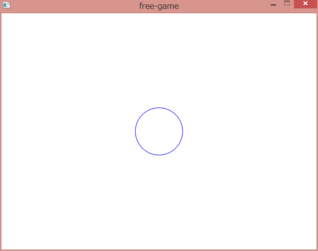

Creating rhythm game with Haskell
====
Fumiaki Kinoshita (part-time employee of IIJ-II)

Introduction
----
Rhythm games, also known as rhythm actions, are very popular genre in Japan. Konami released __Dance Dance Revolution (DDR) in 1998__ -- it is the best successful game among the genre. Another famous one, _Taiko no Tatsujin_(literally, __Expert of Japanese drum__) is being immensely supported by broad age-group of people. Today, various forms of rhythm games have been released one after another.

However, there are few tutorials to create such kind of games. Even if there are, they might be too old, or written in non-English, or/and work only in Windows.

This tutorial focuses on creating a rhythm game without the pain of manipulating audio stuff. Don't be surprised, we use Haskell to do that.

This tutorial has two parts.

* In Part I, let us make a very simple rhythm game. We use the Call engine to develop.
* Part II introduces some technical backgrounds (graphics, signal processing, lens and so on) that support Part I.

I'd be happy if this tutorial helps your curiosity to create a game.

Part I: Get excited
----

> Here we bang! -- Wada-don, "Taiko no Tatsujin"

Firstly, we have to ensure that you have installed GHC. [Haskell Platform](https://www.haskell.org/platform/) is an easy way to install GHC. Note that using 32-bit version of GHC is safer to avoid problems even if your platform is Windows x64.

We have to choose some from several backends:

* If you are using Windows Vista or later, WASAPI is good choice. DirectSound is an another candidate.
* If you are Mac user, you probably like to use CoreAudio.
* On Linux or FreeBSD, we support ALSA or OSS or JACK. If you don't know the differences, choose ALSA for now.
* If you have an ASIO-compatible audio device, and you have registered to Steinberg as a 3rd-party developer, and you desire high-quality sound or low latency, using ASIO is worth.

Very well, let's build `bindings-portaudio`:

> $ cabal install bindings-portaudio -fWASAPI

Rewrite `WASAPI` according to your choice. If you choosed WASAPI, leave it as is, of course.

If it fails, please check if the development library for the backend (e.g. libasound2-dev) is installed. If it throws up something messy, please report to [the GitHub repository](https://github.com/fumieval/bindings-portaudio/issues).

Then let's install `call`.

> $ cabal install call

Creating a window is very EASY.

```haskell
import Call

main = runSystemDefault stand
```

You will see a white 640*480 window -- nothing more.

Now, think of a very simple game: There's a circle, and another circle is approaching. You just touch　when the another circle overlapped the original one. How do we implement this? 

Let's draw a circle for now.

```haskell
import Call

main = runSystemDefault $ do
    k <- new $ animate $ \_ -> translate (V2 320 240) $ color blue $ circleOutline 48
    linkGraphic k
    wait
```



From right to left, "A circle with a radius of 48, the color is blue, translate this thing to (320, 240)" Yes, Call offers functional but imperative APIs. 

But it's really quiet. Let's sound something groovy!

```haskell
import Call

main = runSystemDefault $ do
    m <- readWAVE "test.ogg"
    withSound m stand

```

`withSound` is a function that plays the supplied sound while running an action. `stand` waits indefinitely. It is easy to combine the graphical thing with the music -- Just replace `stand` with something to draw.

